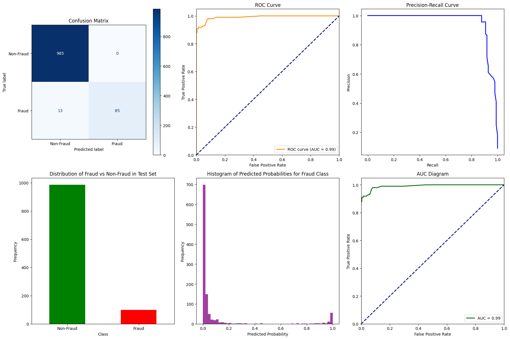
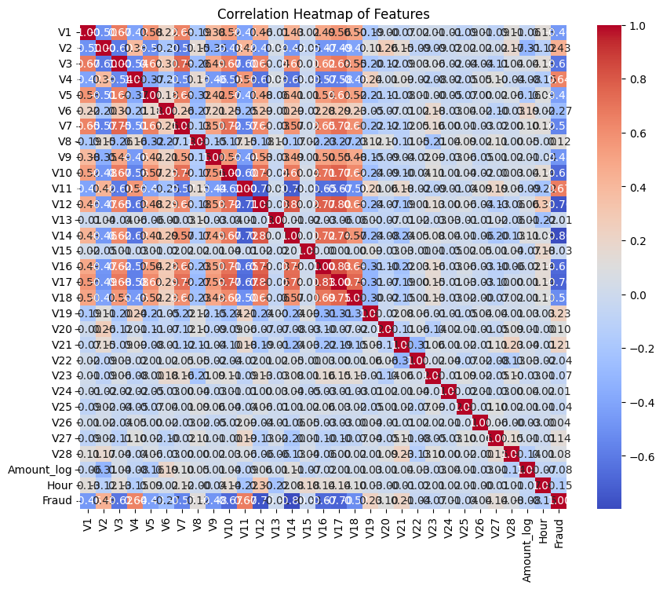

# Credit Card Fraud Detection Using RandomForest Classifier

This project demonstrates a machine learning pipeline to detect credit card fraud using the RandomForest Classifier. The dataset used in this project is the **Credit Card Fraud Detection** dataset, where the task is to identify fraudulent transactions.

## Dataset

The dataset used is `creditcard.csv`. It consists of credit card transactions, with a binary target label indicating whether a transaction is fraudulent (1) or not (0). The dataset is highly imbalanced, with a very low proportion of fraud cases.

Key features of the dataset include:

- **Amount**: The transaction amount.
- **Time**: The time elapsed between this transaction and the first transaction in the dataset.
- **V1-V28**: Principal component analysis (PCA) transformed features.

### Preprocessing Steps

1. **Log Transform**: The `Amount` feature is log-transformed to reduce skewness.
2. **Hour Extraction**: The `Time` feature is converted to extract the hour of the day.
3. **Data Downsampling**: To address class imbalance, the dataset is downsampled to a 10:1 ratio of non-fraud to fraud cases.

### Environment

The model was trained using the following environment:

- Python version: 3.10
- RandomForestClassifier model was used with grid search to tune hyperparameters such as class weights and thresholds.

## Model Training

### RandomForest Classifier

The model selection and evaluation were performed using the **RandomForest Classifier**. A grid search was conducted over a range of class weights and decision thresholds for classifying fraud. The model was evaluated using k-fold cross-validation.

- **Class Weight**: Range of class weights was tested to handle class imbalance.
- **Threshold**: Various decision thresholds were tested to classify fraud transactions.

### Performance Metrics

The model was evaluated using the following metrics:

- **F1-Score (Fraud)**: The harmonic mean of precision and recall for the fraud class.
- **Precision (Fraud)**: The proportion of correctly identified fraud cases.
- **Recall (Fraud)**: The proportion of actual fraud cases correctly identified.
- **ROC-AUC**: The Area Under the Receiver Operating Characteristic Curve.

### Model Training Results

- **Best Class Weight**: 1.07
- **Best Threshold**: 0.495
- **Best F1-Score (Fraud)** from Cross-Validation: 0.90
- **Best Precision (Fraud)** from Cross-Validation: 0.99
- **Best Recall (Fraud)** from Cross-Validation: 0.82

### Test Set Evaluation

After tuning, the model was evaluated on the test set:

- **F1-Score (Fraud)**: 0.93
- **Precision (Fraud)**: 1.00
- **Recall (Fraud)**: 0.87
- **ROC-AUC**: 0.99

### Confusion Matrix

```
[[985   0]
 [ 13  85]]
```

### Classification Report

```
               precision    recall  f1-score   support

   Non-Fraud       0.99      1.00      0.99       985
       Fraud       1.00      0.87      0.93        98

    accuracy                           0.99      1083
   macro avg       0.99      0.93      0.96      1083
weighted avg       0.99      0.99      0.99      1083
```

## How to Run

1. Clone the repository.
2. Install the required dependencies using `requirements.txt`.
3. Run the `randomforest_model.py` script to train the model and evaluate its performance.
4. The trained model is saved in the `./models/` directory.
5. The performance plots and diagrams are saved in the `./plots/` directory.

```bash
pip install -r requirements.txt
jupyter notebook credit-card-fraud-detection-by-ml-randomforest.ipynb
```

## Requirements

The `requirements.txt` file includes all necessary dependencies.


## Project Structure

```
.
├── data/                     # Folder for the dataset
├── models/                   # Saved models and checkpoints
├── plots/                    # Output plots for evaluation
├── credit-card-fraud-detection-by-ml-randomforest.ipynb         # Main script to run the project
├── requirements.txt           # Python dependencies
└── README.md                  # Project description
```

## Visualization

The project includes various visualizations for model performance:

- **Confusion Matrix**
- **ROC Curve**
- **Precision-Recall Curve**
- **Correlation Heatmap** for feature relationships





## Conclusion

The best-performing **RandomForestClassifier** model achieved a **Final F1-score of 0.93** for detecting fraud on the test set. While the precision for fraud detection was perfect (1.00), the recall of 0.87 indicates some fraud transactions were missed. The model showed a very strong overall performance with a **ROC-AUC score of 0.99**, indicating that it can distinguish between fraud and non-fraud transactions very effectively.


The performance of this RandomForest model can now be compared to the **XGBoost** model, which was also tested on the same dataset.

